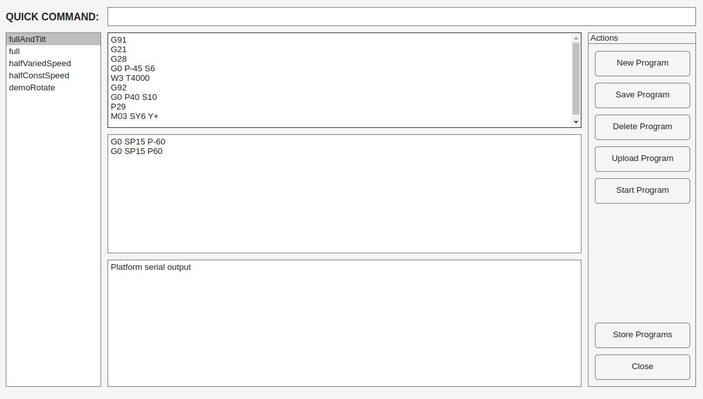

# FMCW Surveillance Radar

This is repo for my bachelors thesis.
This thesis presents the development of a surveillance radar system utilizing the SiRad Easy FMCW module.
FMCW (Frequency-Modulated Continuous Wave) technology enables precise distance measurement of targets while maintaining low power consumption.
Initially, the module’s capabilities are analyzed to identify its operational limits.
A custom two-axis rotary platform is then designed and constructed to enable mechanical beam steering, achieving three-dimensional spatial scanning.
The platform is controlled by an ESP32C6 microcontroller, implementing a G-code-like command interface for convenient operation.
MATLAB is employed to integrate the radar module with the platform to process the acquired data.
While the system’s performance limitations preclude real-time tracking of moving targets, it demonstrates functionality in monitoring diverse static environments, ranging from high-resolution close-range applications to long-range detection of targets up to 300 meters.
To accommodate these use cases, the processing pipeline is designed for flexibility, enabled by great degree of configurability.

#### Two-Axis Platform

#### MATLAB application

## Folder structure
* notes
	* personal notes on workings of Surveillance radars, ideas for processing and such
	* aren't part of any official publication of this thesis
* doc - full official documentation
* matlab - contains all MATLAB code that is responsible for processing data from the radar, displaying it and interfacing with indexing table
* indexing-table - contains all things related to custom two axis indexing table created for this project
	* esp32 - code for ESP32 microcontroller powering the indexing table
	* cad - cad files of mechanical parts and custom PCBs
