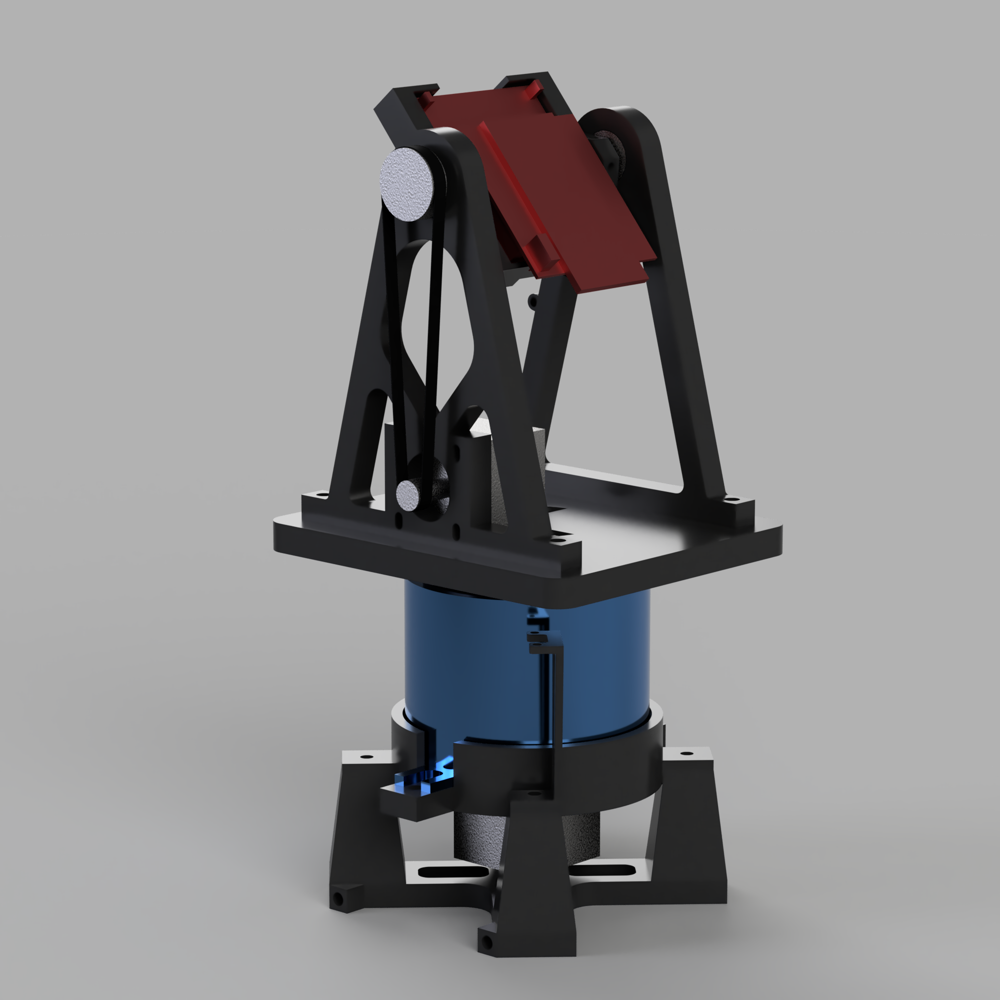
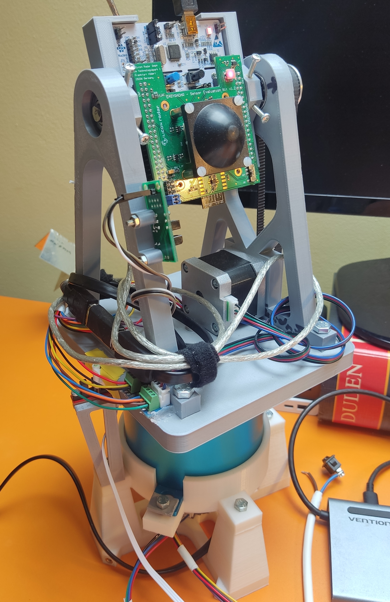

# Indexing table directory

This directory contains all resources regarding custom 2 axis rotary indexing table that has been constructed for this application.
Directory `esp32` concerns firmware for esp32 microcontroller driving the platform.
Cad directory than necessary cad files to 3D print additional components.

